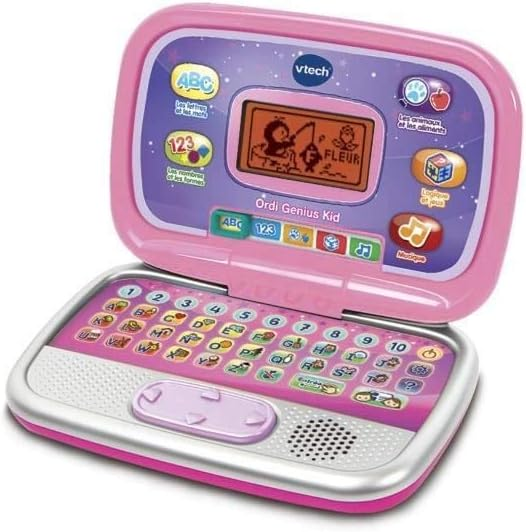

# FAUT QUOI POUR YNOV ?

### Chapitre 1 : Les archis

CEs gros bg d'archis ils ont besoin de quoi faire tourner les logiciels comme autodesk (oui c'est déjà assez chiant comme ça) je leurs propose donc ça : 

https://www.cdiscount.com/informatique/ordinateurs-pc-portables/portable-lenovo-ideapad-gaming-3-15imh05-i7-107/f-1070992-len0195235445273.html

C'est mignon 16 Go RAM avec un ptit i7-10750H et niveau CG GTX 1650 4GB donc je pense que POUR LEURS AUTODESK DE MER.... ça suffirait et c'est QUE 1000balle faites pas genre vous êtes pété de thune

### Chapitre 2 : Les infos (hehe c'est moi wsh)

Donc globalement ici on est sur des gamers avant tout, donc je pense que en vrai de vrai il faut du RGB. 
Ce que je vais proposé c'est un bon processeur avec un bonne ptite CG histoire qu'on puisse faire du game prog quand même 

https://www.fnac.com/PC-Portable-Gaming-Asus-F15-TUF566HC-HN008T-15-6-Intel-Core-i5-16-Go-RAM-512-Go-SSD-Gris-eclipse-1-mois-d-abonnement-Xbox-Game-Pass/a15749694/w-4?oref=dc9fb1a9-58a7-354a-6b20-23d084aa327c&Origin=CMP_GOOGLE_MP_MICRO

Bon globalement ici on a un ptit PC sympa on a un i5 11ème gen avec une RTX 3050 + 16 Go de RAM il a des ptite couleur bien sympa tout ce qu'on aime il suffira largement pour de la prog, si moi j'ai un thinkpad dites vous que ça va passer largement avec le supplément on peut installer LoL vous faites DES HEUREUX PUANT en info ! (et y'a un mois de gamepass c'est génial sah)

### Chapitre 3 : Les audio-visu (les caméramans)

Pour les audio visuel LA il faut un bon truc ils vont faire des rendus donc vas-y on va leurs donner un BON pc genre ça : 

Bon vas-y j'arrête on va partir la dessus : 

https://www.dell.com/fr-fr/shop/cty/pdp/spd/inspiron-16-7630-laptop/cn76519sc?gacd=9695581-5508-5761040-271258816-0&dgc=ST&SA360CID=71700000111268866&gclid=Cj0KCQiAgK2qBhCHARIsAGACuzmSsZiSLVdMvcA9zmWW432sDG-YrH0IFECGryoUEPnRem6mi0ZWXIEaAnqVEALw_wcB&gclsrc=aw.ds

Si la ça va pas je comprends pas ils ONT 32 GO DDR5 un i7 13ème GEN avec une rtx 4060 donc bon je pense que ça suffit et j'ai raison.

### Chapitre 4 : Les Tech and Business 

Bon eux ça fait du figma, du wordpress un chromebook ça suffirait en vrai mais vas-y ils ont besoins d'être un peu styler au dessus mais bon on s'en fou MAIS PAS EUX donc...

https://www.apple.com/fr/shop/buy-mac/macbook-air/13-pouces-m1

Donc on leurs met un ptit mac c'est vrai quoi rien de plus styler qu'être un pigeon (bon csc mais vas-y) je pense que j'ai meme pas besoin de parler.

### Chapitre 5 : Les market com...

Bon en vrai c'est presque pareil que avant mais ils ont besoin de flex encore plus (j'vous aimes sah mais bon) donc on va leurs mettre : 

https://www.apple.com/fr/shop/buy-mac/macbook-pro/14-pouces-gris-sid%C3%A9ral-puce-apple-m3-avec-cpu-8-c%C5%93urs-et-gpu-10-c%C5%93urs-8-go-de-m%C3%A9moire-512go

Et hop

# FIN